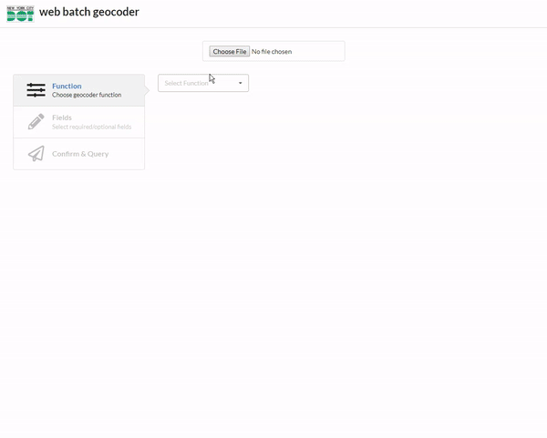

# dot web batch geocoder

Geocoder using Location Service Rest API

This project was bootstrapped with [Create React App](https://github.com/facebookincubator/create-react-app).

## requirements

1. Upload a spreadsheet (csv, excel)
2. Geocode Using different functions (Address, Intersection, Block) 
3. Select the columns, I want to use for the query.
4. Preview the spreadsheet
5. Preview errors and correct for field or location errors
6. Download data in excel, geojson or shapefile

## in action



## change api endpoints

edit `./config/api.js` , then run with corresponding command

```bash
npm run build:dev
npm run build:qa
npm run build:prod
```

## notes

This is my first full fledged react app. It was built originally for myself because I didn't want to use GeoSupport, and python scripts. It lacks good data practices like pubsub or redux. Everything is handled by the main app state, which is really messy...

here is a short overview of how events and data is handled.

1. Everything is a part of App.js, a file is uploaded to the FileUpload component that triggers the "_onFileChange" handler that will save the data in state though header/body.

2. This updates TablePreview component, and Form component, which handles generation of the query for each row, which then will return this results state array.

3. The results state array updates ColumnsPicker, and TableResult, which handle the exports (calls helpers, which will take in a formated object or will format the object). Shp-write will crash if the file is too big.

you should probably rebuild the application (or use DCP's batch geocoder, if it is finshed), if you are task in fixing a bug in the code. sorry and best of luck.